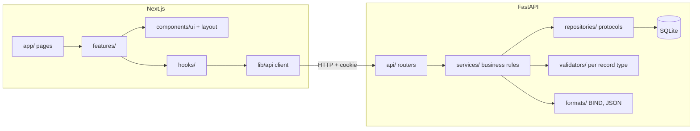

# AWS Route 53 Console Clone

A full-stack clone of the Amazon Route 53 console: hosted zones and DNS records with full CRUD, a FastAPI backend, SQLite persistence and a Next.js (TypeScript) frontend that follows the console's navigation, tables, forms, modals and notifications. It manages DNS *data* only; it does not answer real DNS queries.

## Live demo

| | |
| --- | --- |
| Frontend | https://aws-route-53-clone-one.vercel.app |
| Backend API | https://aws-route53-clone-backend-ovgy.onrender.com |
| Interactive API docs | https://aws-route53-clone-backend-ovgy.onrender.com/docs |

Click **Try the demo** on the login page, or sign in with **`admin` / `admin`**. The free-tier backend sleeps when idle, so the first request after a pause can take about a minute.

## Features

- **Authentication (mocked):** login, logout and session persistence through a signed, expiring, HTTP-only cookie.
- **Demo login:** one click on "Explore the demo console" signs in without a password and loads 12 sample hosted zones (public and private) with records of every type, weighted routing and alias records. "Reset demo data" in the account menu restores the samples at any time.
- **Hosted zones:** list, search, sort, paginate, create (public or private), edit the description, delete (type-to-confirm). Every new zone starts with its apex **NS** and **SOA** records.
- **DNS records:** list, search, filter by type, sort, paginate, create, edit, delete and bulk delete for **A, AAAA, CNAME, MX, NS, PTR, SRV, TXT and CAA**, with simple and weighted routing and alias records.
- **Validation:** each record type's value format is validated on the server (IPv4/IPv6, MX priority, SRV fields, CAA syntax, CNAME rules and so on) and surfaced inline in the form.
- **Route 53 look and feel:** built on [Cloudscape](https://cloudscape.design), the open-source design system the AWS console itself uses: app layout with top navigation, side navigation and breadcrumbs, sortable tables with filtering, pagination and preferences, forms, modals and flash notifications. A few theme tokens give the console's orange pill buttons.
- **Mocked sections:** the Dashboard is a static page and Traffic policies shows the console's empty state. Health checks, Profiles, Resolver, Domains and the rest of the navigation render a "Coming soon" page.
- **Bonus:** BIND zone file import, BIND and JSON export, dark mode, keyboard shortcuts, bulk delete.

### Keyboard shortcuts

| Key | Action |
| --- | --- |
| `/` or `Alt+S` | Focus the global search |
| `c` | Create a hosted zone / record (depending on the page) |
| `r` | Refresh the current table |
| `?` | Show the shortcut list |
| `Esc` | Close a dialog |

## Tech stack

| Layer | Technology |
| --- | --- |
| Frontend | Next.js 16 (App Router), React 19, TypeScript, Cloudscape Design System |
| Backend | FastAPI, Pydantic v2, SQLAlchemy 2 |
| Database | SQLite |
| Parsing | dnspython (BIND zone files) |
| Tests | pytest (backend), Vitest + Testing Library (frontend) |

## Architecture



### Backend layout and SOLID

```
backend/app/
  api/            routers + dependency wiring (deps.py is the only place concrete classes are assembled)
  services/       AuthService, ZoneService, RecordService, TransferService: all business rules
  repositories/   Protocol interfaces + SQLAlchemy implementations
  validators/     one validator class per DNS record type + a registry
  formats/        ZoneFormat interface with BindFormat and JsonFormat
  core/           config (env), security (hashing, tokens), errors, DNS name helpers, id generation
  models.py  schemas.py  database.py  main.py
```

| Principle | Where |
| --- | --- |
| **Single responsibility** | Routers only translate HTTP; services hold rules; repositories hold queries; validators check one record type each. |
| **Open/closed** | A new record type is a new `RecordValueValidator` registered in `validators/records.py`; a new import/export format is a new `ZoneFormat`. No existing code changes. |
| **Liskov substitution** | All validators and formats honour the same contract, so registries and `TransferService` treat them interchangeably. |
| **Interface segregation** | Small `UserRepository`, `ZoneRepository`, `RecordRepository` protocols, each exposing only what its service needs. |
| **Dependency inversion** | Services depend on the repository protocols and receive implementations through FastAPI `Depends`; configuration comes from the environment, not constants. |

Errors raised by services (`NotFoundError`, `ConflictError`, `DomainValidationError`, `AuthenticationError`) are mapped to HTTP responses in one handler in `main.py`.

### Frontend layout

```
frontend/src/
  app/          routes: thin pages composing features and UI
  features/     hosted-zones/ and records/: forms, modals, tables for each domain area
  components/   ui/ (ServerTable, ConfirmModal, ComingSoon) and layout/ (AppShell, top and side navigation, breadcrumbs, notifications)
  hooks/        useResource, useDebouncedValue, useHotkeys, useCrumbLabel
  lib/          typed API client and resources, navigation config, theme and breadcrumb stores
  context/      AppContext (session, theme, notifications)
```

Navigation, breadcrumbs and the "Coming soon" titles all derive from one config (`lib/navigation.ts`).

## Setup

**Prerequisites:** Node.js 24+ and Python 3 (developed and tested on 3.14).

### Backend

```bash
cd backend
python -m venv .venv
.venv\Scripts\activate        # macOS/Linux: source .venv/bin/activate
pip install -r requirements.txt
uvicorn app.main:app --reload --port 8000
```

API docs: http://localhost:8000/docs. On first start the tables are created and the `admin` / `admin` account is seeded. Older databases are upgraded in place.

> **Troubleshooting `--reload` on Windows:** if the log shows `Reloading...` but the server never comes back up (observed when uvicorn ran detached, without a console window), stop it and start it again by hand.

### Frontend

```bash
cd frontend
npm install
npm run dev                    # http://localhost:3000
```

### Tests and checks

```bash
cd backend  && pytest
cd frontend && npm test && npm run lint && npm run typecheck && npm run build
```

### Environment variables

| Variable | Where | Default | Purpose |
| --- | --- | --- | --- |
| `DATABASE_URL` | backend | `sqlite:///./route53.db` | SQLite location |
| `SECRET_KEY` | backend | dev-only value | Signs session tokens. **Set this when deploying.** |
| `FRONTEND_URL` | backend | `http://localhost:3000` | CORS origin and cookie mode |
| `TOKEN_TTL_SECONDS` | backend | `86400` | Session lifetime |
| `ADMIN_USERNAME`, `ADMIN_PASSWORD`, `AWS_ACCOUNT_ID` | backend | `admin`, `admin`, `1234-5678-9012` | Seeded mock account |
| `DEMO_MODE` | backend | `true` | Set to `false` to remove the passwordless demo login |
| `DEMO_USERNAME` | backend | `demo` | Name of the demo account |
| `NEXT_PUBLIC_API_URL` | frontend | `http://localhost:8000` | Backend URL the browser calls |
| `API_PROXY_TARGET` | frontend (build time) | unset | Optional same-origin proxy, see Deployment |

## Database schema

SQLite, created through SQLAlchemy models in `backend/app/models.py`.

**`users`**: `id` PK, `username` unique, `password_hash` (scrypt, salted; legacy SHA-256 hashes are upgraded on login), `aws_account_id`.

**`hosted_zones`**: `id` PK (`Z` + 13 chars), `name` (absolute, trailing dot, indexed), `description`, `type` (`Public`/`Private`), `created_by`, `vpc_id`, `vpc_region`, `record_count` (kept equal to the real row count on every change), `created_at`.

**`dns_records`**: `id` PK (`R` + 13 chars), `hosted_zone_id` FK → `hosted_zones.id` (cascade delete), `name` (absolute), `type`, `routing_policy` (`Simple`/`Weighted`), `ttl`, `value` (newline-separated), `weight`, `set_id`, `alias`, `alias_target`, `health_check_id`, `created_at`. Composite index on `(hosted_zone_id, name, type)`.

## API overview

All endpoints except login and `/health` require the session cookie (or `Authorization: Bearer <token>`).

| Method & path | Purpose |
| --- | --- |
| `POST /api/auth/login` · `POST /api/auth/logout` · `GET /api/auth/me` | Session |
| `POST /api/auth/demo` | Passwordless demo sign-in; loads the sample zones when the console is empty |
| `POST /api/demo/reset` | Replace all data with the samples (demo account only, otherwise 403) |
| `GET /api/hosted-zones` | List. Query: `query`, `page`, `page_size`, `sort_by`, `sort_dir` |
| `POST /api/hosted-zones` | Create (adds apex NS + SOA) |
| `GET` · `PUT` · `DELETE /api/hosted-zones/{id}` | Read, update description, delete with its records |
| `GET /api/hosted-zones/{id}/records` | List. Query: `query`, `type`, `page`, `page_size`, `sort_by`, `sort_dir` |
| `POST /api/hosted-zones/{id}/records` | Create |
| `GET` · `PUT` · `DELETE /api/hosted-zones/{id}/records/{record_id}` | Read, replace, delete |
| `POST /api/hosted-zones/{id}/records/bulk-delete` | Body `{"record_ids": [...]}` |
| `POST /api/hosted-zones/{id}/import?format=bind\|json` | Multipart `file` upload; reports imported and skipped records |
| `GET /api/hosted-zones/{id}/export?format=bind\|json` | Download the zone |
| `GET /health` | Liveness |

List endpoints return `{ "items": [...], "total": n, "page": 1, "page_size": 10 }`. Errors return `{ "detail": "message", "errors": [{ "field": "value", "message": "…" }] }`.

**Rules enforced by the API:** apex NS/SOA records cannot be created, edited or deleted; a record can only be edited or deleted through its own zone; a CNAME cannot share a name with another type; duplicate simple records are rejected; weighted records need a weight (0–255) and a unique record ID per name and type; record names must sit inside the zone.

## Deployment

The repo includes a Render blueprint (`render.yaml`) for the backend; the frontend deploys on Vercel with root directory `frontend`.

**Backend (Render or similar).** Root directory `backend`, build `pip install -r requirements.txt`, start `python -m uvicorn app.main:app --host 0.0.0.0 --port $PORT`. Set `SECRET_KEY`, `FRONTEND_URL` and `DATABASE_URL`. SQLite needs a persistent disk to survive restarts and redeploys (point `DATABASE_URL` at it, e.g. `sqlite:////data/route53.db`); without one the data resets. Check which instance types your host offers disks for.

**Keeping the free backend awake.** `.github/workflows/keep-alive.yml` pings `GET /health` every 10 minutes. Add a repository variable `BACKEND_URL` (Settings, Secrets and variables, Actions, Variables) set to the backend URL to enable it. The ping prevents idle sleep but not restarts, so the SQLite data still resets on a free instance.

**Frontend (Vercel or similar).** Root directory `frontend`. Either set `NEXT_PUBLIC_API_URL` to the backend URL, or, to avoid third-party-cookie blocking in Safari and private windows when the two apps are on different sites, set `API_PROXY_TARGET` to the backend URL at build time and leave `NEXT_PUBLIC_API_URL` unset. The browser then talks to `/api/*` on the frontend's own domain.

## Assumptions, mocked parts and limitations

- **Authentication is mocked:** one seeded account, no registration, no IAM, organizations or billing. The cookie carries a signed token with an expiry.
- **The demo account has no password.** It can only be reached through the one-click demo sign-in, and it shares the same data as every other account (there is no per-user data), so anyone using the demo can change or delete it. Set `DEMO_MODE=false` on a deployment where that is not wanted.
- **Mocked sections:** Dashboard (static cards), Health checks, Profiles, Traffic policies, Resolver, Global Resolver and Domains are placeholders.
- **No real DNS:** records are stored and validated but nothing is served. Name servers on new zones are randomly generated AWS-style names.
- **Routing policies:** Simple and Weighted only. Alias targets are free-text DNS names, not looked up against real AWS resources.
- **Hosted zone edit** changes the description only, as in Route 53.
- **Private zones** record a VPC ID and region but are not validated against AWS.
- **Alias records** are exported to BIND as a comment because BIND has no alias concept.
- The UI uses the public Cloudscape components (Apache-2.0). The favicon and the Route 53 tile use the Route 53 service icon (`frontend/public/route53-logo.webp`); the "aws" wordmark in the top bar is a simple approximation. In the top bar, CloudShell, the apps grid and notifications are buttons that only show an explanatory message, and the region selector offers just "Global" because Route 53 is a global service.
- SQLite is single-writer; this is a demo-scale design.
